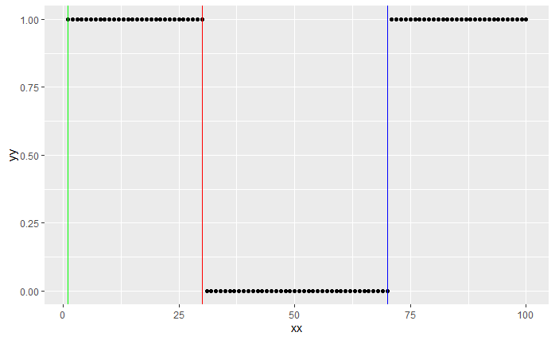

# Seminar 11

No online register today as I have forgotten my LSE password... If you could not attend the seminar for COVID related reasons just send an email and I will mark this in the class register.


### Note on the tree splitting rule with one predictor

In the seminar I mentioned that our tree splitting algorithm might not perform as well as we hope because it attacks the segmentation problem *greedily*. In the first step it splits the data in half and models the CEF as a constant to the lefty and right of the split - i.e. the wrong functional form is assumed for at least one of the two segments.

This is only a problem in the *noisy* settings. Indeed if the true CEF is piecewise constant and no additive noise is present we will always recover the correct segments. Try tweaking the following code to convince yourself:

```r
xx <- 1:100
yy <- c(rep(1,30),rep(0,40),rep(1,30))

split_point_1 <- tree_split(xx,yy)
ind_left <- which(xx <= split_point_1)
ind_right <- setdiff(1:length(xx), ind_left)

split_point_2 <- tree_split(xx[ind_left], yy[ind_left])
split_point_3 <- tree_split(xx[ind_right], yy[ind_right])

ggplot(
  data = data.frame(x = xx, y = yy),
  aes(xx,yy)) +
  geom_point() +
  geom_vline(xintercept = split_point_1, colour = "red") +
  geom_vline(xintercept = split_point_2, colour = "green") +
  geom_vline(xintercept = split_point_3, colour = "blue")
```




#### Extra information (not examinable and completely unrelated to ST310)

The problem of finding the optimal splitting points one at a time, with only one predictor, is closely related to the problem of [change point detection](https://en.wikipedia.org/wiki/Change_detection), which is still an active research area! For anyone interested in learning more here is an [excellent review article](https://arxiv.org/pdf/2012.12814v1.pdf).

To overcome the problem I mentioned in class we can do something which at first seems like madness: take many random sub-sample of the data and look for the best split point on each. The rationale being that if we are lucky one or more sub-samples will contain exactly one true split point. This technique is known as [wild binary segmentation](https://stats.lse.ac.uk/fryzlewicz/wbs/wbs.pdf) and works remarkable well in practice. 
