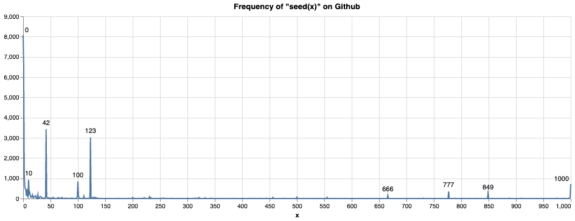

```{r setup, message = FALSE, echo=FALSE}
knitr::opts_chunk$set(echo = TRUE)
```

Please load the following packages before we start. You may need to install `glmnet`. 

```{r, include=FALSE}
library(tidyverse)
library(broom)
library(glmnet)
```

**Important!** We will be doing some simulations in this seminar; set a seed to make sure your work is reproducible.  

```{r}
set.seed(42)
```

(Bonus question: why is 42 the best seed?)



# High-dimensional regression

Generate some data from a high-dimensional model; experiment with changing `pp` and `nn`. 

```{r}

```

## Ridge regression with `glmnet`

We will study ridge regression in more detail soon\*. For now you only need to know it's a method we can use for fitting high-dimensional regression models. It also involves a tuning parameter called "lambda," and **larger values of lambda result in simpler fitted models**. Use the `glmnet` package to fit a ridge regression model on the same data as in the previous part. Hint: read about the `alpha` input to the `glmnet` function in the documentation.

\* *For the mathematically curiouos*

$$
\hat{\beta}_{\lambda} = {\arg\min}_{\beta} \left \{ \sum_{i=1}^n \left ( y_i - \beta_0 - \sum_{j=1}^p \beta_j x_{i,j}  \right )^2 + \lambda \sum_{j=1}^p \beta_j^2 \right \}
$$

**Question:** why don't we apply shrinkage to the intercept?

**Answer:** ???


```{r message = FALSE}
lambda_seq <- 10**(-10:3)
model_ridge <- glmnet(X, y, intercept = FALSE, alpha = 0, lambda = lambda_seq)
```

What does plotting the model object show? Read the documentation for `plot.glmnet`; how will the plot chnage if we set the `xvar` varaible to somthing else? 

```{r}

```

## Estimation error

Compute the mean-squared error of the coefficient estimates at different values of lambda. Plot the values. 

```{r}

```

## Prediction error

Compute predictions using the estimated coefficients and the mean-squared prediction error at different values of lambda

```{r}

```


## Discussion

#### In a real data analysis (rather than simulation), which of the above things could we not compute, and why?

#### How do the results change depending on lambda?

#### How do the results change depending on dimension? (e.g. if p > n)

# Overfitting to variance and ID generalisation

Generate a new sample from the same distribution (which things stay fixed?)

```{r}

```

Calculate the prediction error on this new sample at different values of lambda. 

```{r}

```

## Discussion


#### Compare to prediction error on the original (training) sample

#### How do these compare if we increase the original (training) sample size?

# "Overfitting to bias" and OOD generalisation

There are many ways to change the distribution for a new sample... 

#### Change beta (maybe add a small amount of noise)

Try adding a small ammount of uniform noise to $\beta$

```{r}

```

Calculate the prediction error on this new sample at different values of lambda. 

```{r}

```


#### Change the distribution of X and/or the errors

Let the predictors and error term follow a $t$ distribution with $\nu = 5$ degrees of freedom. 

```{r}

```

```{r}

```

**Question** why is this situation not too dissimilar from the ID problem? 


## Discussion

#### How do these compare if we increase the original (training) sample size?

#### What are the similarities/differences in your conclusions between ID/OOD generalisation?

# Comparison with gradient descent

Copy/paste your gradient descent code for ordinary linear regression here. Does it converge? If so, to what? Check distance (MSE) from the true beta and from the ridge estimate of beta (at different values of lambda, or a very small lambda close to zero)

First define the loss functions again: 

```{r}
least_squares_loss <- function(X, Y, beta)
{
  #' Returns least squares loss
  #'
  #'@param X matrix, dim = (n x p)
  #'@param y vector, dim = (n x 1)
  #'@param beta vector, dim = (p x 1)
  
  sum((Y - X %*% beta)**2)

}

least_squares_gradient <- function(X,Y, beta)
{
  #' Returns least squares gradient
  #'
  #'@param X matrix, dim = (n x p)
  #'@param y vector, dim = (n x 1)
  #'@param beta vector, dim = (p x 1)
  
  -2 * t(X) %*% (Y - X %*% beta)

}
```

Now write the code for gradient descent with stopping criteria. 

```{r}

```

Check distance (MSE) from the true beta and from the ridge estimate of beta (at different values of lambda, or a very small lambda close to zero)

```{r}

```
