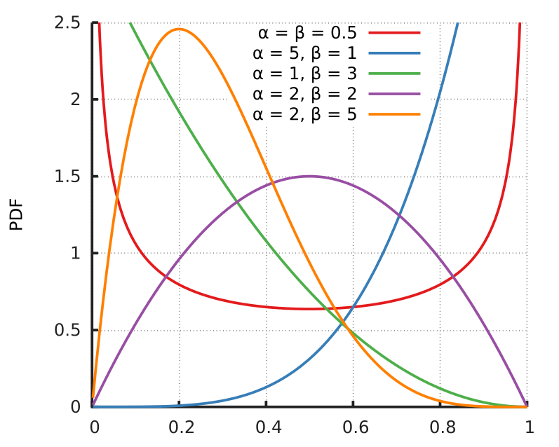

```{r setup, include=FALSE}
knitr::opts_chunk$set(echo = TRUE)
library(tidyverse)  
library(tidymodels) 
library(modelr)     
library(kernlab)    
library(gapminder)  
```

**Important** We will be doing some simulations, set a random seed so your work is reproducible. 

```{r}
set.seed(42)
```


# 1-d smooth regression

#### Generate a one-dimensional example with a non-linear relationship

We will draw predictors from a Beta distribution. The `beta` distribution is closer to uniform if `s2` is closer to 1, so increasing `s2` creates a region of the predictor space that has relatively less training data. 



```{r}
ff <- function(x) sin(4*pi*x)
nn <- 400
s1 <- 1
s2 <- 3
noise_sd <- .4

train1d <- 
  data.frame(
    xx = rbeta(nn, s1, s2)
    )
```

Generate some test data from the same distribution (*ID*): 

```{r}
test1d_ID <- 
  data.frame(
    xx = rbeta(nn, s1, s2)
    )
```

Generate some test data where predictors are drawn from a slightly different beta distribution and add a slowly varying function to the CEF (*OD*). 

```{r}
test1d_OOD <- 
    data.frame(
    xx = rbeta(nn) # more data with larger x values
    )
```

Finally, make a grid of training points. 

```{r}
train1d_grid <- 
  data_grid(train1d,
          xx = seq_range(c(.05, .95), 2000, expand = .05))
```

#### Read `?geom_smooth` and change the `span` manually for a better fit

```{r}
ggplot(train1d, aes(xx, yy)) + 
  geom_point() +
  geom_smooth()
```

### Linear regression with a polynomial transform of x

```{r}
model_lm <- lm(yy ~ poly(xx, ...), data = train1d)

augment(model_lm,
        newdata = train1d_grid) %>%
  ggplot(aes(xx, yy)) +
  geom_point(data = train1d) +
  geom_line(aes(y = .fitted))
```

### Kernel regression

Use the `ksvm` function and `kernelMatrix` functions to fit non-linear kernel regression models and plot the predictions on `train1d_grid`

```{r}
k_1fit <- ...
```

```{r}
svm_predictions <- train1d_grid %>%
      mutate(.fitted = predict(k_1fit, newdata = train1d_grid))

train1d %>%
  ggplot(aes(xx, yy)) +
  geom_point(data = train1d) +
  geom_line(
    data = svm_predictions,
    aes(y = .fitted))
```

### Comparisons

```{r}
fits <- list(
augment(model_lm,
        newdata = test1d_ID) %>%
  mutate(generalization = "ID", model = "lm"),

test1d_ID %>%
      mutate(.fitted = predict(k_1fit, newdata = test1d_ID),
             generalization = "ID", model = "ksvm"),

augment(model_lm,
        newdata = test1d_OOD) %>%
  mutate(generalization = "OOD", model = "lm"),

test1d_OOD %>%
      mutate(.fitted = predict(k_1fit, newdata = test1d_OOD),
             generalization = "OOD", model = "ksvm")) 

map_dfr(fits, rbind) %>%
  mutate(resid = yy - .fitted) %>%
  group_by(generalization, model) %>%
  summarize(MSE = mean(resid^2), .groups = "keep")
```

## Some importnat questions

#### What happens to the local accuracy for larger values of x if `s2` is increased? Why?

#### What happens as `sd` is increased? Or if `n` is decreased? How is this different from the previous question?

#### What happens if you increase `sigma` in `rbfdot`?

#### How would ID generalization vs OOD vary depending on the above trade-offs? Consider OOD for values of x slightly both outside the left and right range of the training data


# 2d non-linear classification data

Assign functions with zero set that defines the perfect (Bayes) decision boundary:

```{r}
nn <- 800

true_boundary_function <- function(x1, x2) {
  thing <- x1^2*x2^3
  (x1^2 + x2^2 - 1)^3 - thing^2
}
```

Generate some training data where your training data should take the form of a data frame with columns: 

 * `x1` and `x2` for the predictors
 * `seperable` for class labels if the classes were perfectly separable
 * `yy` for class labels with some noise

```{r}
train <- data.frame(
  x1 = 1.5*(1 - 2*runif(nn)),
  x2 = 1.5*(1 - 2*runif(nn))
) 
```

### Plot the data

```{r}
train_plot <-
  ggplot(train, aes(x1, x2)) +
  geom_point(aes(color = yy)) +
  xlab("") + ylab("")
  
train_plot
```

### Plot the Bayes decision boundary

```{r}
decision_surface <- 
  data_grid(train,
          x1 = seq_range(x1, 300, expand = .05),
          x2 = seq_range(x2, 300, expand = .05)) %>%
  mutate(z = true_boundary_function(x1, x2))

boundary_plot <-
  train_plot +
  geom_contour(
    data = decision_surface,
    aes(x1, x2, z=z),
    bins = 2,
    size = 1,
    color = "black",
    alpha = .5)

boundary_plot
```

### How well does linear classification do?

Also try changing the formula to fit a logistic regression model with non-linear transformations of the predictors

```{r}
logit_model <- NULL

logit_surface <- logit_model %>%
   augment(type.predict = "response",
              newdata = decision_surface)
```

Plot decision boundary of logistic model

```{r}
boundary_plot +
  geom_contour(
    data = logit_surface,
    aes(x1, x2, z = .fitted),
    size = 1,
    color = "green") 
```

### Classify 2d example with k-nearest neighbors

Write a function to implement k-NN classification

You may use matrix operations and simple functions like `sort` but not any more sophisticated built-in R functions (or libraries)

#### Write a function that computes some distance between two points

You can choose which notion of distance you want to use

```{r}
Dist <- function(x1, x2)
{
  #' L2 distance between two vectors
  #'
  #'@param x1 vector 
  #'@param x2 vector
  
  
}
```

#### Write a function that outputs the y values for the k-nearest nearest neighbors of a point x0

```{r}
nearest_k_values <- function(x0, kk, xx, yy) 
  {
  #' Returns the k closest values to x0
  #'
  #'@param x0 vector, 
  #'@param kk int, number of neigbours
  #'@param xx matrix, predictors
  #'@param yy vector, classes
  

}
```

#### Write a function that outputs a classification using majority vote

```{r}
knn <- function(x0, kk, xx, yy) 
  {
  #' Returns the KNN class prediction for x0
  #'
  #'@param x0 vector, 
  #'@param kk int, number of neigbours
  #'@param xx matrix, predictors
  #'@param yy vector, classes
  
  }
```


#### Evaluate your function at various points, using various values of k, and compare the output to the plotted training data

Try points where the nearest neighbors are clearly majority 0 or 1, and a point where the portion is relatively even. Run the code below a few times and see if the answers change, then pick a different `K` and try again

```{r}
bootstrap_sample <- sample(1:nrow(train), replace = TRUE)
x <- train[bootstrap_sample, 1:2]
y <- train$y[bootstrap_sample]
```


In a majority 1 region

```{r}
knn(x0 = c(0,0), kk = 1, xx = x, yy = y)
```

In a majority 0 region

```{r}
knn(x0 = c(0,1.2), kk = 1, xx = x, yy = y)
```

In a relatively even region

```{r}
knn(x0 = c(1,1), kk = 1, xx = x, yy = y)
```
